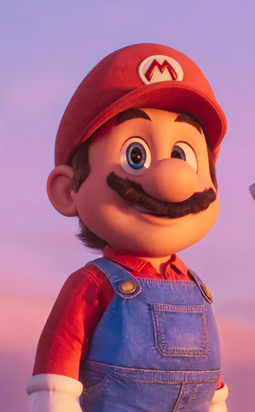
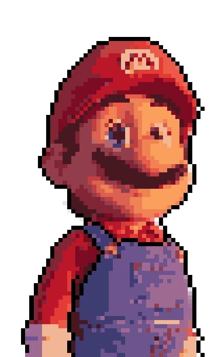

# GimmeSquares

A command-line tool to transform photos into clean pixel art with optional contours. It uses **K-Means quantization** for palettes, **rembg** for (optional) AI background removal, and some Canny/Scharr contour detection to (optionally) draw outlines.

## Installation

You can install this script directly from GitHub as a global tool using `uv`:

```console
uv tool install git+[https://github.com/neginja/gimmesquares](https://github.com/neginja/gimmesquares)
```

## Usage

Basic Conversion

```console
gmsq input.png output.png --pixel-size 8 --colors 16
```

With Contours

```console
gsqm input.png output.png --pixel-size 8 --colors 16 --outline --outline-color "#000000"
```

With background removel

```console
gsqm input.png output.png --pixel-size 8 --colors 16 --no-bg
```

Use `gmsq --help` to display help.

It is recommended to use `png` images (as an output) for support of alpha channels, especially when removing backgrounds and using `--save-extras`.

## Example

```console
gmsq demo_data/mario.png  demo_data/mario_pixels.png --no-bg --colors 16 --pixel-size 8 --outline --outline-sensitivity 0.1 --k-size 31
```

> [!NOTE]
> The kernel size is 31 because it's approximately the half size of the eyes and the M logo for which we don't want outlines, the threshold sensitivity has been tweaked with trial and error.

 

It's not perfect but it can be fine-tuned manually in your favorite editor, and if you use `--save-extras` you can use independent files (pixelated, outlines) to edit the pixel-art and outlines as layers.